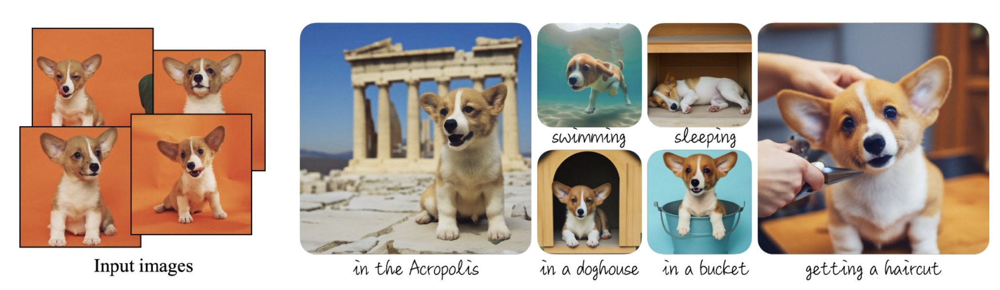

# DreamBooth Stylized Image Generation Service



## Overview

This project implements a service for generating stylized images using the DreamBooth approach. By fine-tuning a pre-trained text-to-image diffusion model on a small set of subject images (typically 3–5), the system binds a unique identifier to the subject. The service then leverages FastAPI for a robust backend and Gradio to provide an interactive user interface for generating novel, stylized images based on user-supplied references.

**Key Features:**
- **Personalized Generation:** Fine-tunes a diffusion model using a few reference images to capture subject identity.
- **Interactive UI:** Uses Gradio to let users upload images and specify text prompts for stylization.
- **State-of-the-Art Methodology:** Inspired by the DreamBooth approach, which incorporates a class-specific prior preservation loss to maintain subject fidelity while generating diverse outputs.

## Methodology

### DreamBooth Approach
The core idea behind DreamBooth is to “implant” a subject into a text-to-image diffusion model using a few images. Key highlights include:
- **Unique Identifier Binding:** A rare token (or unique identifier) is attached to the subject, enabling the model to generate the subject in a variety of contexts.
- **Fine-Tuning:** The model is fine-tuned with both subject images and corresponding prompts (e.g., “a [V] dog”), leveraging a class-specific prior preservation loss to prevent overfitting and language drift.
- **Applications:** This method allows for subject recontextualization, text-guided view synthesis, and artistic rendering—paving the way for creative applications like stylized image generation.

For more details, refer to the paper:  
**DreamBooth: Fine Tuning Text-to-Image Diffusion Models for Subject-Driven Generation** by Nataniel Ruiz et al. ([Project Page](https://dreambooth.github.io/)).

### Technical Implementation
- **Backend:** Built using FastAPI to serve REST endpoints for image generation.
- **User Interface:** Gradio is integrated for interactive testing—users can upload five reference images and provide text prompts to generate stylized images.
- **Modular Code Structure:** The project is divided into modules and functions to enhance readability and maintainability. 
- **Dependency Management:** We use Poetry along with a `requirements.txt` file for managing dependencies and ensuring reproducibility.

## Project Structure

```
GAI_course_project/
├── configs/              # Configuration files (e.g., YAML, JSON settings)
├── data/                 # Datasets and data files (raw, processed, etc.)
├── deploy/               # Deployment scripts and container configurations
├── images/               # Visual assets such as logos and diagrams
├── notebooks/            # Jupyter notebooks for experiments and analysis
├── paper/                # Research paper files and related documentation
├── scripts/              # Utility and automation scripts
├── src/                  # Source code for the project (modules, functions, etc.)
├── LICENSE               # License file
├── pyproject.toml        # Project configuration file for Poetry
├── poetry.lock           # Lock file for dependency management with Poetry
├── README.md             # Project overview and setup instructions
└── requirements.txt      # Additional dependency list
```

## Setup and Installation

### Prerequisites
- Python >=3.11
- [Poetry](https://python-poetry.org/) for dependency management
- Additional libraries as listed in `requirements.txt`

### Installation Steps
1. **Clone the Repository:**
   ```bash
   git clone https://github.com/IVproger/GAI_course_project.git
   cd GAI_course_project
   ```
2. **Install Dependencies:**
   ```bash
   # Option 1: Using env activate (recommended)
   poetry install
   poetry env use python
   poetry env activate

   # Option 2: Using shell plugin
   poetry plugin add poetry-shell-plugin
   poetry install
   poetry shell
   ```
   **OR**
   ```bash
   python -m venv venv
   source venv/bin/activate   # For Windows: venv\Scripts\activate
   pip install --upgrade pip
   pip install -r requirements.txt
   ```
   
## Usage

1. **Upload Reference Images:**  
   Users are required to upload 5 reference images of the subject.
   
2. **Input Text Prompt:**  
   Provide a descriptive text prompt to guide the stylization process.
   
3. **Generate Images:**  
   The backend processes the input using the DreamBooth fine-tuning method to generate stylized images. The results are displayed via the Gradio interface.

For further experiments and analysis, refer to the Jupyter Notebook in the `notebooks` directory.

## Contributors

- **Ivan Golov** (i.golov@innopolis.university)
- **Roman Makeev**
- **Maxim Martyshov**

## Project Stage №1: Proof-of-Concept (POC)

This stage represents the initial proof-of-concept where the DreamBooth fine-tuning process was applied. In this phase, the model was fine-tuned on the provided reference images (
Corgi dog from DreamBooth ref dataset) to capture the unique subject characteristics, resulting in early experimental outputs.

### Source image:
   

### Tuning Output Samples

The images below are sample outputs obtained after tuning:

### Target_generated_image
 **Prompt:**  
 "a xon dog"  
 

### Styled_generated_image №1
**Prompt:**  
"a xon dog in beautifyl landscape with river, forest and mountines"  


### Styled_generated_image №2
**Prompt:**  
"a xon dog in astronaut costume against moon and stars. The xon dog stands proudly on the rocky lunar surface, with its paw slightly raised as if exploring"  


### Styled_generated_image №3
**Prompt:**  
"'a xon dog in cool sunglasses sitting in the sport car, smillings and have good time"  


## References

- **DreamBooth: Fine Tuning Text-to-Image Diffusion Models for Subject-Driven Generation**  
  Nataniel Ruiz, Yuanzhen Li, Varun Jampani, et al.  
  [Project Page](https://dreambooth.github.io/)
- Additional literature on text-to-image diffusion models and generative adversarial networks.

## License

This project is licensed under the [MIT License](./LICENSE).

## Acknowledgements

We thank the course instructors, collaborators, and the open-source community for providing the tools and libraries that made this project possible.

---
